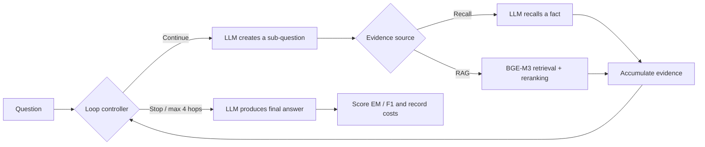

# Laya Multi-Hop QA: Code and Reproducible Results

[繁體中文](README.md) · [Paper PDF](paper/main.pdf) · [All results](results/README.md) · [Reproduction guide](docs/REPRODUCING.md)

**Who should decide when a multi-hop question-answering agent has enough evidence: the language model itself, or a smaller specialized controller?**

Research artifact for *Calibrated Loop Control for Multi-Hop QA with Small Language Models*,
by **Pin-Hung Lin and Te-Lun Yang**. This repository evaluates the existing
[Laya](https://github.com/NandhaKishorM/laya) model; it is not the upstream Laya project.
The included manuscript is a research draft, not an accepted conference/journal paper.

## Experiment

A shared loop decomposes a question, gathers evidence, and decides whether to continue.
The LLM always generates sub-questions and final answers. A 2 × 2 design changes only
the evidence source (closed-book recall or retrieval + reranking) and controller (LLM or Laya).

| Condition | Evidence | Controller |
|---|---|---|
| Recall + LLM | LLM recall | LLM |
| RAG + LLM | BGE-M3 + FAISS + reranker | LLM |
| Recall + Laya | LLM recall | Fine-tuned Laya |
| RAG + Laya | BGE-M3 + FAISS + reranker | Fine-tuned Laya |



Qwen3.5 {0.8B, 2B, 4B, 9B, 27B} × {HotpotQA, 2WikiMultihopQA, MuSiQue} × four conditions
= **60 configurations**. Each has 200 questions: **12,000 final records**, covering
600 distinct questions evaluated under 20 model/condition combinations.
Each retrieval corpus pools the sampled questions' supporting and distractor paragraphs,
not all Wikipedia. Laya is a 322M non-autoregressive decision model, fine-tuned on
simulated weak-label states, with held-out temperature calibration. Maximum loop length: 4 hops.

## Main result

RAG EM (%): **LLM control → Laya control (difference in percentage points)**.

| Qwen3.5 | HotpotQA | 2Wiki | MuSiQue |
|---|---:|---:|---:|
| 0.8B | 23.0 → 30.5 (+7.5) | 10.5 → 19.5 (+9.0) | 3.5 → 10.0 (+6.5) |
| 2B | 40.0 → 47.5 (+7.5) | 35.0 → 36.5 (+1.5) | 9.5 → 13.5 (+4.0) |
| 4B | 64.5 → 56.5 (-8.0) | 60.0 → 44.5 (-15.5) | 33.5 → 22.0 (-11.5) |
| 9B | 64.0 → 60.5 (-3.5) | 61.0 → 46.5 (-14.5) | 32.0 → 25.5 (-6.5) |
| 27B | 67.5 → 61.0 (-6.5) | 68.5 → 56.0 (-12.5) | 37.0 → 31.5 (-5.5) |

Laya improves point estimates for 0.8B/2B but reduces EM for 4B–27B. It generally
reduces tokens and hops; premature stopping can leave required evidence missing.
Some positive-effect 95% intervals include zero. See [all paired intervals](paper/analysis/bootstrap_ci.csv).


## Reproduce statistics without a GPU

Python 3.12, from a clone of this repository:

```bash
python -m venv .venv
source .venv/bin/activate
python -m pip install -r requirements-reproduce.txt
python scripts/reproduce.py
```

PowerShell: replace activation with `.\.venv\Scripts\Activate.ps1`.
No model download or API key is needed. The command verifies SHA256 checksums and
recomputes answer scores, all 60 summary rows, 60 bootstrap effects, 280 error rows,
13 LaTeX tables, and 5 figures in `build/reproduced/`. It fails if values differ from
the archived paper run. [GitHub Actions](https://github.com/RoyalMilkteaMaster/laya-multihop-qa/actions) runs the same CPU check.

For GPU setup, index construction, controller fine-tuning, smoke tests, full inference,
and new-run analysis, use the [reproduction guide](docs/REPRODUCING.md).

## Included artifacts

- [Executable benchmark](multihop_benchmark/), tests, and the original `uv.lock`.
- [Frozen data splits and corpus](data/datasets/), with upstream attribution and licenses.
- [Full per-question answers and traces](data/runs/main-20260930/records/), including retry history.
- [Summary CSV](data/runs/main-20260930/summary.csv), [training/evaluation reports](data/runs/laya_eval/),
  [paper source/PDF](paper/), and [all results and figure previews](results/README.md).
- [Data schema](docs/DATA.md) and [provenance/validation scope](docs/PROVENANCE.md).

## Reproducibility limits

Model weights are not bundled. Public base models are downloaded separately; fine-tuning
code, frozen input splits, hyperparameters, and the recorded checkpoint hash are provided.
Training/inference may vary with hardware, kernels, or changed upstream model revisions.
The CPU route reproduces statistics from archived answers; it does not rerun inference
or remeasure latency. Controller-quality metrics are copied from the historical aggregate
report because individual controller predictions were not archived.

This is one main run per configuration. Bootstrap intervals cover question sampling only.
The 27B model operated near the 24 GB VRAM limit. Two timed-out questions received additional
retries and eventually completed; final zero timeout rates do not imply no timeout occurred.

## Citation and licenses

Use [CITATION.cff](CITATION.cff), cite the manuscript, and acknowledge Laya and the upstream
datasets. Original code and repository documentation: [MIT](LICENSE). Data and third-party
material retain their own terms; the manuscript is excluded from the MIT grant.
See [third-party notices](THIRD_PARTY_NOTICES.md).
