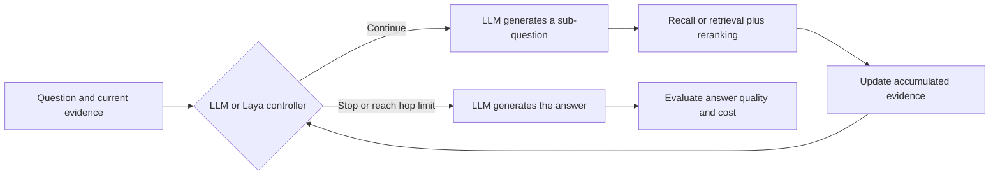

# Calibrated Loop Control for Multi-Hop QA with Small Language Models

### When should an external decision model control the retrieval loop?

**Pin-Hung Lin · Te-Lun Yang**

National Cheng Kung University · National Taiwan University

[Paper PDF](paper/main.pdf) · [繁體中文](README.md) · [Chinese full text](paper/zh-TW/main.md) · [Results](results/README.md) · [Reproduction guide](docs/REPRODUCING.md)

Code and experimental data accompanying our paper. We study the division of work between generation and control: when a language model gathers evidence iteratively, how does assigning the decision to continue or stop to a smaller, calibrated model affect answer quality and computational cost?

**5 model sizes · 3 datasets · 2 × 2 factorial design · 60 configurations · 12,000 final evaluation records**

## 1. Motivation: retrieving evidence also requires deciding what comes next

RAG gives language models access to external evidence. Multi-hop questions, however, often require identifying an intermediate entity before looking up its properties. To answer which country a film's director was born in, for example, an agent first needs to identify the director and then find the birthplace. One retrieval step may not recover the entire evidence chain.

An agent therefore decomposes questions, collects evidence, and updates its state repeatedly. This creates two risks: **stopping too early leaves necessary evidence missing; continuing too long increases retrieval, generation, and inference costs.** For a small language model running locally, generating text and managing this loop may also require different capabilities.

Our research question follows: **can the LLM concentrate on decomposition and answering while a separate model handles structured control decisions? Under what conditions does that division of work help?**

## 2. Hypothesis: evaluate generation and control as separate roles

We use the existing [Laya](https://github.com/NandhaKishorM/laya) model as the decision layer. Laya is a roughly 322M-parameter non-autoregressive model that answers binary, multiple-choice, and ordinal questions in one forward pass, returning option probabilities. These outputs express three decisions needed at each step:

| Decision | Role in the loop |
|---|---|
| **Is the evidence sufficient?** | Estimate sufficiency and decide whether to stop |
| **What should happen next?** | Suggest answering, asking another sub-question, or reformulating a query |
| **How much evidence is missing?** | Predict 0, 1, or 2 (two or more) missing evidence items |

The LLM continues to generate sub-questions, queries, and final answers. Laya reads the question, previous sub-questions, and accumulated evidence. A sufficiency probability of at least 0.5 forces the loop to stop and the LLM to answer; the other decisions guide the next step. Every condition has a maximum of four steps.

This division may reduce generation costs, but a faster decision may also end a useful search prematurely. We therefore investigate three questions together:

| Research question | Relationship under study | Evidence |
|---|---|---|
| **RQ1: Accuracy** | Does changing the controller affect answer quality, and does this depend on the evidence source? | EM, token-level F1, paired bootstrap intervals |
| **RQ2: Cost** | Does external control reduce the computational and procedural cost per question? | Tokens, hops, latency, VRAM, tool-call failures |
| **RQ3: Scale** | Does the same controller suit language models of different capabilities? | Qwen3.5 at 0.8B, 2B, 4B, 9B, and 27B |

## 3. Experimental design: distinguish evidence effects from control effects

Comparing a closed-book model with a system that adds both RAG and Laya would confound access to evidence with the control policy. We use a **2 × 2 factorial design** so that all four conditions share the same decomposition loop.

| Condition | Evidence source | Controller | Comparison enabled |
|---|---|---|---|
| **Recall + LLM** | Closed-book LLM recall | LLM | Baseline within the shared loop |
| **RAG + LLM** | Retrieval and reranking | LLM | Effect of external evidence |
| **Recall + Laya** | Closed-book LLM recall | Laya | Control effect under recall |
| **RAG + Laya** | Retrieval and reranking | Laya | Control effect under retrieval and interaction |



Retrieval uses BGE-M3, FAISS, and bge-reranker-v2-m3 over a shared corpus formed from each dataset's sampled supporting and distractor paragraphs. The tool interface also changes with the controller: the LLM can ask or submit an answer under its own control; under Laya, stopping is enforced externally and only the asking tool remains available when continuing. Results must therefore be interpreted together with this interface difference.

**Why fine-tune Laya?** The datasets provide answers and supporting paragraphs, but no direct labels for whether an agent should stop at a particular state. We simulate four states—no evidence, partial evidence, complete evidence, and distractors only—from those annotations. These provide weak labels for one controller shared across datasets, followed by probability calibration on a separate split.

The resulting data contains **32,451 training decisions, 3,996 calibration decisions, and 4,032 held-out test decisions**. Performance on simulated states diagnoses the controller; whether it improves an actual QA loop is tested separately in the end-to-end experiments. [Training and evaluation reports](data/runs/laya_eval/)

## 4. Results: costs fall, but the accuracy effect reverses with model scale

We evaluate the five Qwen3.5 sizes on HotpotQA, 2WikiMultihopQA, and MuSiQue under all four conditions, with 200 questions per configuration. This yields **600 distinct questions evaluated under 20 model/condition combinations**, or 12,000 final records.

External evidence contributes substantially: with LLM control, RAG improves EM over recall by up to **43.5 percentage points**. Holding retrieval constant then reveals how the effect of changing the controller varies with model scale.


*Each point is EM for RAG + Laya minus RAG + LLM. Positive values favor Laya; negative values favor LLM control. Bars show paired bootstrap 95% confidence intervals; hollow markers include zero. This overview uses the paper's existing results, with no additional experiment.*

| Qwen3.5 size | HotpotQA | 2Wiki | MuSiQue |
|---|---:|---:|---:|
| 0.8B | +7.5 | +9.0 | +6.5 |
| 2B | +7.5 | +1.5 | +4.0 |
| 4B | −8.0 | −15.5 | −11.5 |
| 9B | −3.5 | −14.5 | −6.5 |
| 27B | −6.5 | −12.5 | −5.5 |

*EM differences in percentage points. See [all 60 configurations](results/README.md) for absolute EM/F1 and costs, and the [bootstrap CSV](paper/analysis/bootstrap_ci.csv) for intervals.*

**Smaller models benefit, with different strengths of evidence.** For 0.8B, EM increases on all three datasets and every interval excludes zero. The 2B point estimates also increase, but only HotpotQA's interval excludes zero. For example, 2B on HotpotQA improves from 40.0% to 47.5% EM while median latency falls from 1,880 ms to 657 ms.

**Larger models trade accuracy for shorter loops.** For 4B, 9B, and 27B, EM point estimates decline on all three datasets. Laya reduces tokens and hops, but LLM control uses more steps and achieves higher accuracy; seven of these nine intervals exclude zero.

## 5. Interpreting the result: a saved step may also be a necessary step

An aggregate score does not identify where a question failed. We use the step-level traces to classify RAG errors as invalid tool calls, retrieval misses, premature stops, incorrect answers despite evidence coverage, and other failures. This connects answer quality with the cost of the process that produced it.

Under RAG + Laya, the most frequent error is **stopping while annotated supporting evidence is still missing**. This is consistent with shorter, cheaper loops, but also suggests their cost: a controller can demand an answer before a bridging fact arrives. For 0.8B, the accuracy improvement also accompanies fewer invalid tool calls. Since the available tools change from two to one, the improvement cannot be attributed entirely to better stopping decisions. [Taxonomy and rules](docs/DATA.md#statistics-and-limitations)

The paper reaches a conditional conclusion: **the value of external control depends on the generator, evidence source, and control interface.** In this setting, Laya improves both accuracy and efficiency for the smallest model; larger models exhibit an accuracy–cost trade-off. Deployment decisions should measure both at the intended model scale.

The evidence comes from one model family, a fixed threshold, and one main run per configuration. Intervals describe question-sampling uncertainty. The corpora contain passages from sampled questions, and the 27B latency results reflect operation near the GPU memory limit. See the [paper's discussion](paper/sections/discussion.tex) and [data documentation](docs/DATA.md) for scope and retry accounting.

## 6. Trace the conclusions to the implementation and evidence

| Reading goal | Resource |
|---|---|
| Full argument and related work | [Paper](paper/main.pdf) / [Chinese full text](paper/zh-TW/main.md) |
| Accuracy and costs at every scale | [Results guide, 60 configurations, and table mapping](results/README.md) |
| Individual answers and collected evidence | [Records](data/runs/main-20260930/records/) / [schema](docs/DATA.md) |
| Shared loop and prompts | [agent/](multihop_benchmark/multihop_benchmark/agent/) |
| Weak labels, fine-tuning, and calibration | [laya_decision/](multihop_benchmark/multihop_benchmark/laya_decision/) / [reports](data/runs/laya_eval/) |
| The exact question and corpus snapshot | [Frozen splits](data/datasets/) |
| Recompute statistics or run models | [Reproduction guide](docs/REPRODUCING.md) / [provenance](docs/PROVENANCE.md) |

### Recompute statistics and figures from the saved answers on a CPU

With Python 3.12, in Bash:

```bash
git clone https://github.com/RoyalMilkteaMaster/laya-multihop-qa.git
cd laya-multihop-qa
python -m venv .venv
source .venv/bin/activate
python -m pip install -r requirements-reproduce.txt
python scripts/reproduce.py
```

PowerShell activation: `.\.venv\Scripts\Activate.ps1`. Output goes to `build/reproduced/`, covering answer scores, 60 summary rows, 60 bootstrap effects, 280 error-taxonomy rows, 13 LaTeX tables, and five paper figures. Checksums and outputs are checked against the archived results. Regenerate this page's additional effect overview with `python scripts/plot_controller_effect.py`.

The [GPU guide](docs/REPRODUCING.md) covers indexing, Laya fine-tuning, and new QA runs. Code, frozen inputs, and parameters are included; prepare model weights separately as documented. Historical controller evaluation is available as an aggregate report; its ECE/Brier metrics are not recalculated by the CPU route.

## Citation and licenses

Please cite the paper and [CITATION.cff](CITATION.cff), identifying the version used. Acknowledge Laya and the original datasets listed in the [paper's references](paper/refs.bib) and [third-party notices](THIRD_PARTY_NOTICES.md).

Original code and repository documentation use the [MIT license](LICENSE). The paper, datasets, and third-party material retain their respective rights and terms.
