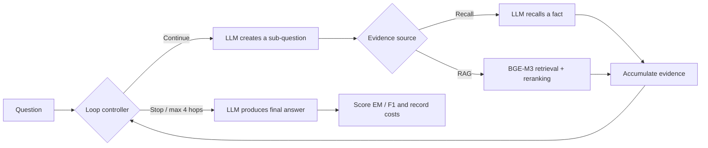
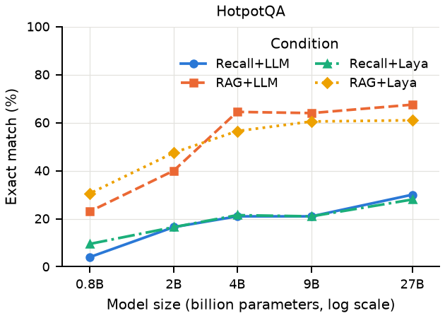
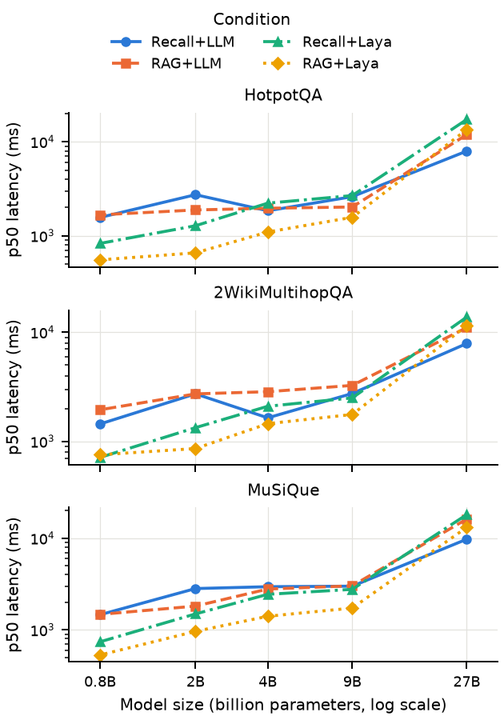

# Laya 多跳問答：程式碼、實驗資料與可重現結果

[English](README.en.md) · [研究稿 PDF](paper/main.pdf) · [中文研究稿](paper/zh-TW/main.md) · [完整結果](results/README.md) · [執行說明](docs/REPRODUCING.md)

**研究問題：多跳問答進行到一半時，應由大型語言模型自己判斷「證據夠了嗎」，還是交給一個較小的專門決策模型？**

這是研究稿 *Calibrated Loop Control for Multi-Hop QA with Small Language Models* 的研究程式與資料，作者為 **Pin-Hung Lin（林品宏）、Te-Lun Yang（楊德倫）**。
本研究使用既有 [Laya](https://github.com/NandhaKishorM/laya) 模型，實作並評估多跳問答迴圈；這裡不是 Laya 模型的原始開發倉庫。

## 這個程式在做什麼？

例如回答一題需要串接兩份文件的問題時，系統會先拆出子問題、取得證據，再判斷是否繼續。
所有條件使用同一個迴圈，只改變「證據來源」與「誰控制停止」。LLM 始終負責拆題與產生最終答案。

| 配置 | 證據從哪裡來 | 誰決定停止與作答 |
|---|---|---|
| Recall + LLM | LLM 依內部知識回憶 | LLM |
| RAG + LLM | 外部段落檢索＋重新排序 | LLM |
| Recall + Laya | LLM 依內部知識回憶 | 微調後的 Laya |
| RAG + Laya | 外部段落檢索＋重新排序 | 微調後的 Laya |



Laya 是約 322M 參數的非自迴歸決策模型。每一步輸出證據充分機率、下一個動作與剩餘跳數；程式依決策執行，最多 4 步。
RAG 使用 BGE-M3、FAISS 與 bge-reranker-v2-m3。索引由各資料集抽樣題目的支持與干擾段落組成，不是全維基百科搜尋。

## 實驗規模與主要發現

- **5 種模型**：Qwen3.5 0.8B、2B、4B、9B、27B。
- **3 個資料集**：HotpotQA、2WikiMultihopQA、MuSiQue。
- **4 種配置 × 每組 200 題 = 60 組配置、12,000 筆最終評估紀錄**。實際是 600 道不同題目，各在 20 種模型／配置下評估。
- **訓練流程也公開**：弱標籤狀態模擬、RLCD 微調、溫度校準與決策層評估。

下表為 RAG 情境的 EM（完全正確率，%）：**LLM 控制 → Laya 控制（差值，百分點）**。

| Qwen3.5 | HotpotQA | 2Wiki | MuSiQue |
|---|---:|---:|---:|
| 0.8B | 23.0 → 30.5 (+7.5) | 10.5 → 19.5 (+9.0) | 3.5 → 10.0 (+6.5) |
| 2B | 40.0 → 47.5 (+7.5) | 35.0 → 36.5 (+1.5) | 9.5 → 13.5 (+4.0) |
| 4B | 64.5 → 56.5 (-8.0) | 60.0 → 44.5 (-15.5) | 33.5 → 22.0 (-11.5) |
| 9B | 64.0 → 60.5 (-3.5) | 61.0 → 46.5 (-14.5) | 32.0 → 25.5 (-6.5) |
| 27B | 67.5 → 61.0 (-6.5) | 68.5 → 56.0 (-12.5) | 37.0 → 31.5 (-5.5) |

Laya 對 0.8B、2B 的 EM 點估計有提升，對 4B–27B 則下降。它通常減少 token 與迴圈步數，但較早停止可能漏掉必要證據。
這是有取捨的結果；部分提升的 95% 信賴區間包含零，不能一律解讀為顯著進步。完整區間見 [bootstrap 結果](paper/analysis/bootstrap_ci.csv)。





## 在一般電腦重算論文結果（不需要 GPU）

先安裝 Python 3.12，在 Bash 執行：

```bash
git clone https://github.com/RoyalMilkteaMaster/laya-multihop-qa.git
cd laya-multihop-qa
python -m venv .venv
source .venv/bin/activate
python -m pip install -r requirements-reproduce.txt
python scripts/reproduce.py
```

Windows PowerShell 將啟用環境那行改成 `.\.venv\Scripts\Activate.ps1`。

程式會核對檔案 SHA256，從已保存的答案重算 12,000 筆評分，再產生 **60 列彙總、60 個 bootstrap 效果估計、280 列錯誤分類、13 張 LaTeX 表格、5 張圖**，寫入 `build/reproduced/`。
若統計結果與原稿資料不一致會直接失敗。輸出中的 `verification.json` 可查看檢查結果。

這一步驗證的是「保存的答案 → 統計 → 表圖」。重新訓練並跑模型的 Linux／WSL2 步驟、硬體需求與 smoke test，見 [完整重現指南](docs/REPRODUCING.md)。

## 想看哪個部分？

| 內容 | 位置 |
|---|---|
| 核心問答迴圈、LLM 提示詞 | [agent/](multihop_benchmark/multihop_benchmark/agent/) |
| 弱標籤、微調、校準、Laya 決策 | [laya_decision/](multihop_benchmark/multihop_benchmark/laya_decision/) |
| 資料前處理與抽樣 | [datasets/](multihop_benchmark/multihop_benchmark/datasets/) |
| 向量檢索與段落重排 | [retrieval/](multihop_benchmark/multihop_benchmark/retrieval/) |
| 完整逐題答案、錯誤、每步證據與耗用量 | [records/](data/runs/main-20260930/records/) |
| 實際使用的訓練／校準／測試題與檢索語料 | [固定資料快照](data/datasets/) |
| 60 組完整指標（可用 Excel 開啟） | [summary.csv](data/runs/main-20260930/summary.csv) |
| 微調參數與評估報告 | [laya_eval/](data/runs/laya_eval/) |
| 論文表圖與來源對照 | [results/README.md](results/README.md) |
| 資料欄位、計分、授權 | [DATA.md](docs/DATA.md) |
| 發布版本來源與驗證範圍 | [PROVENANCE.md](docs/PROVENANCE.md) |

## 重現範圍與已知限制

**程式、固定題目、逐題紀錄、微調流程與表圖都有公開；模型權重不放進這個 Git 倉庫。**
Qwen／BGE／基底 Laya 依指南下載，微調 Laya 可由提供的訓練切分重建。原始 checkpoint hash 與模型 digest 已保存。
重跑模型可能受硬體、套件、上游 checkpoint 與訓練隨機性影響，不保證逐題答案或耗時完全相同。

本研究每組只有一個正式 run，信賴區間只涵蓋抽樣題目的不確定性。27B 的顯存壓力會影響延遲；兩道 timeout 題曾額外重試，詳見 [資料說明](docs/DATA.md)。
決策層品質表來自歷史評估報告；當時沒有保存逐筆決策預測，因此 CPU 重算不會獨立重建該報告的 ECE／Brier 等數字。

## 引用與授權

本研究稿尚非已接受的會議／期刊論文。引用程式與資料可使用 [CITATION.cff](CITATION.cff)，並引用研究稿與原始資料集。

原創程式碼與倉庫說明採用 [MIT](LICENSE)。資料集與引用的段落保留原授權，研究稿及第三方內容不套用 MIT，詳見 [授權範圍](THIRD_PARTY_NOTICES.md)。
