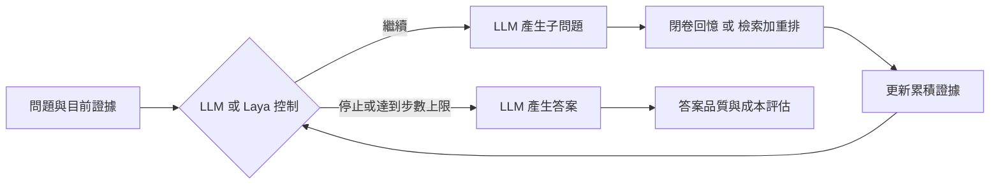

# Calibrated Loop Control for Multi-Hop QA with Small Language Models

### 小型語言模型的多跳問答：何時應由外部決策模型控制迴圈？

**Pin-Hung Lin（林品宏） · Te-Lun Yang（楊德倫）**

National Cheng Kung University · National Taiwan University

[論文 PDF](paper/main.pdf) · [中文全文](paper/zh-TW/main.md) · [English](README.en.md) · [實驗結果](results/README.md) · [重現指南](docs/REPRODUCING.md)

這是本論文的程式碼與實驗資料倉庫。我們探討生成與決策的分工：當語言模型逐步蒐集證據時，將「何時繼續、何時停止」交給一個較小、經校準的決策模型，會如何改變答案品質與運算成本？

**5 種模型規模 · 3 個資料集 · 2 × 2 因子設計 · 60 組配置 · 12,000 筆最終評估紀錄**

## 1. 研究起點：取得資料之後，還需要判斷下一步

RAG 讓語言模型可以從外部文件取得作答依據。然而，多跳問答往往需要先找到一個中間實體，再追查它的屬性。例如，要回答「某部電影的導演出生在哪個國家」，系統必須先辨識導演，再取得出生地資訊。一次檢索未必能補齊整條證據鏈。

因此，問答系統需要反覆拆解問題、取得證據並更新狀態。這個流程同時帶來兩種風險：**停得太早，答案缺乏必要依據；停得太晚，則增加檢索、生成與推論成本。** 對在地端運行的小型語言模型而言，產生文字與管理整個迴圈，也可能是能力需求不同的兩件事。

我們由此提出研究問題：**能否讓 LLM 專注於拆題與回答，將迴圈中的結構化判斷交給另一個模型？這樣的分工，又會在什麼條件下成立？**

## 2. 研究假設：把生成與控制分開評估

我們選用既有的 [Laya](https://github.com/NandhaKishorM/laya) 作為決策層。Laya 約有 322M 參數，可在一次前向傳播中回答是非、選擇與序數問題，並輸出選項機率。這使它適合表達每一步所需的三種判斷：

| 決策 | 在問答流程中的用途 |
|---|---|
| **證據是否充分？** | 輸出充分機率，決定是否停止並作答 |
| **下一步做什麼？** | 建議直接作答、再拆一個子問題，或改寫查詢 |
| **還缺多少關鍵證據？** | 以 0、1、2（兩個以上）表示缺少的證據數量 |

LLM 持續負責產生子問題、查詢與最終答案；Laya 讀取目前的問題、已問子問題與累積證據。當充分機率達到 0.5 時，程式強制停止蒐集證據並要求 LLM 回答；其餘決策則作為下一步的提示。所有條件最多執行 4 個步驟。

這個分工可能節省生成成本，但較快的決策也可能過早結束搜尋。因此，我們同時檢驗三個問題：

| 研究問題 | 要釐清的關係 | 評估依據 |
|---|---|---|
| **RQ1：準確率** | 更換控制者，是否改變答案品質？是否取決於證據來源？ | EM、token-level F1、成對 bootstrap 信賴區間 |
| **RQ2：成本** | 控制權移轉，是否減少每題的運算與流程負擔？ | Tokens、步數、延遲、VRAM、工具呼叫失敗率 |
| **RQ3：規模** | 同一種控制方式，是否適合不同能力的語言模型？ | 比較 Qwen3.5 的 0.8B、2B、4B、9B、27B |

## 3. 實驗設計：分開辨識證據來源與控制方式的影響

如果只比較一個閉卷模型與一個「RAG＋Laya」系統，改善可能來自新增的知識，也可能來自控制方式。為了辨識這兩者，我們採用 **2 × 2 因子設計**，讓四個條件共用相同的問題拆解流程。

| 配置 | 證據來源 | 迴圈控制者 | 比較用途 |
|---|---|---|---|
| **Recall + LLM** | LLM 閉卷回憶 | LLM | 共用迴圈下的基準 |
| **RAG + LLM** | 文件檢索與重新排序 | LLM | 觀察外部證據的影響 |
| **Recall + Laya** | LLM 閉卷回憶 | Laya | 觀察閉卷情境的控制效果 |
| **RAG + Laya** | 文件檢索與重新排序 | Laya | 觀察檢索情境的控制效果與交互作用 |



RAG 使用 BGE-M3、FAISS 與 bge-reranker-v2-m3。每個資料集將抽樣題目的支持段落與干擾段落合併成共用語料庫。控制權移轉也會改變工具介面：LLM 自行控制時可選擇提問或提交答案；Laya 控制時，由 Laya 決定停止，LLM 繼續時只有提問工具。因此，結果須連同工具介面差異一起解讀。

**為什麼還要微調 Laya？** 原始資料集標註了答案與支持段落，卻沒有直接提供「此刻該不該停」的訓練標籤。我們利用支持段落模擬「沒有證據、部分證據、完整證據、只有干擾」四種狀態，據此產生弱標籤，訓練一個供三個資料集共用的控制器，再用獨立切分校準機率。

最終使用 **32,451 筆訓練決策、3,996 筆校準決策、4,032 筆保留測試決策**。模擬狀態上的表現是控制器的診斷指標；它能否改善真正的問答迴圈，仍由後續端到端實驗檢驗。[訓練與評估紀錄](data/runs/laya_eval/)

## 4. 實驗結果：成本下降，準確率效果卻隨模型規模反轉

我們在 HotpotQA、2WikiMultihopQA 與 MuSiQue 上，對五種 Qwen3.5 規模分別執行四個條件，每組 200 題。這是 **600 道不同題目，在 20 種模型／配置組合下評估**，共產生 12,000 筆最終紀錄。

首先，外部證據對準確率有明顯影響：在 LLM 控制下，RAG 相對閉卷回憶的 EM 提升最高達 **43.5 個百分點**。接著，在同樣使用 RAG 的前提下比較控制者，才看得出 Laya 的影響如何隨模型規模改變。


*每個點是 RAG＋Laya 減去 RAG＋LLM 的 EM 差異；右側代表 Laya 較高，左側代表 LLM 較高。線段為成對 bootstrap 95% 信賴區間，空心點表示區間包含零。資料取自論文既有結果，未新增實驗。*

| Qwen3.5 規模 | HotpotQA | 2Wiki | MuSiQue |
|---|---:|---:|---:|
| 0.8B | +7.5 | +9.0 | +6.5 |
| 2B | +7.5 | +1.5 | +4.0 |
| 4B | −8.0 | −15.5 | −11.5 |
| 9B | −3.5 | −14.5 | −6.5 |
| 27B | −6.5 | −12.5 | −5.5 |

*單位：EM 百分點。完整原始 EM／F1 與成本見 [60 組結果](results/README.md)，信賴區間見 [bootstrap CSV](paper/analysis/bootstrap_ci.csv)。*

**較小模型：分工帶來改善，但證據強度有所不同。** 0.8B 在三個資料集的 EM 都提升，且信賴區間均排除零；2B 的點估計也都上升，但只有 HotpotQA 的區間排除零。例如，2B 在 HotpotQA 的 EM 從 40.0% 升至 47.5%，中位延遲從 1,880 ms 降至 657 ms。

**較大模型：較短的流程伴隨準確率損失。** 4B、9B、27B 在三個資料集的 EM 點估計都下降。Laya 確實減少 token 與步數，但模型自行控制時可以用更多步驟蒐集證據，並達到較高準確率；九個比較中有七個信賴區間排除零。

## 5. 從結果回看假設：省下的步驟，也可能是必要步驟

單看最終分數，無法分辨失敗發生在哪裡。我們進一步沿著逐步紀錄，將 RAG 的錯誤分類為工具呼叫失敗、檢索未命中、過早停止、證據已齊全但仍答錯等情況，追查成本與答案品質之間的關係。

在 RAG＋Laya 下，最常見的錯誤是**停止時仍缺少標註的支持證據**。這個現象與較短迴圈及較低成本相呼應，也提示了代價：控制器可能在橋接資訊到達之前，就要求模型作答。對 0.8B 而言，改善還伴隨工具呼叫失敗減少；由於可用工具也從兩個變成一個，不能把改善全數歸因於停止判斷本身。[錯誤分類與規則](docs/DATA.md#statistics-and-limitations)

本論文因此得到一個有條件的結論：**外部決策模型的價值，取決於它所協助的生成模型、證據來源與控制介面。** 在本實驗設定下，Laya 對最小模型兼具準確率與效率收益；對較大模型，則呈現準確率與成本的取捨。部署時，需要在目標模型規模上同時評估兩者。

這些結果來自同一個模型家族、固定控制門檻與每組一次正式執行。信賴區間描述題目抽樣的不確定性；語料庫由抽樣題目構成，27B 的延遲也受到接近顯存上限的運行條件影響。適用範圍與重試紀錄詳見[論文討論](paper/sections/discussion.tex)及[資料說明](docs/DATA.md)。

## 6. 從論文結論追溯到程式與資料

| 閱讀目的 | 對應內容 |
|---|---|
| 理解完整論證與相關研究 | [英文論文](paper/main.pdf)／[中文全文](paper/zh-TW/main.md) |
| 檢查各模型的準確率與成本 | [結果導讀、60 組指標與表圖對照](results/README.md) |
| 追查單題答案與每一步證據 | [逐題紀錄](data/runs/main-20260930/records/)／[資料欄位](docs/DATA.md) |
| 閱讀共用迴圈與提示詞 | [agent/](multihop_benchmark/multihop_benchmark/agent/) |
| 檢查弱標籤、微調與校準 | [laya_decision/](multihop_benchmark/multihop_benchmark/laya_decision/)／[訓練報告](data/runs/laya_eval/) |
| 取得相同題目與檢索語料 | [固定資料切分](data/datasets/) |
| 重算統計或重新執行模型 | [重現指南](docs/REPRODUCING.md)／[版本來源與驗證](docs/PROVENANCE.md) |

### 在 CPU 上重算已保存答案的統計與表圖

使用 Python 3.12，在 Bash 執行：

```bash
git clone https://github.com/RoyalMilkteaMaster/laya-multihop-qa.git
cd laya-multihop-qa
python -m venv .venv
source .venv/bin/activate
python -m pip install -r requirements-reproduce.txt
python scripts/reproduce.py
```

Windows PowerShell 的啟用指令為 `.\.venv\Scripts\Activate.ps1`。重算結果寫入 `build/reproduced/`，涵蓋逐題答案評分、60 列彙總、60 個 bootstrap 效果估計、280 列錯誤分類、13 張 LaTeX 表格與 5 張論文圖；程式會核對雜湊值與保存的結果。首頁的效果總覽另以 `python scripts/plot_controller_effect.py` 從同一份 CSV 產生。

完整 GPU 流程包含建立索引、微調 Laya 與重新執行問答，見[重現指南](docs/REPRODUCING.md)。倉庫提供訓練程式、固定資料與參數，模型權重依指南另行準備。歷史決策層評估僅保存彙總報告，其 ECE／Brier 等數值不由上述 CPU 流程重新計算。

## 引用與授權

使用程式或結果時，請引用本論文與 [CITATION.cff](CITATION.cff)，並註明所用版本。Laya 與原始資料集的來源列於[論文參考文獻](paper/refs.bib)及[第三方聲明](THIRD_PARTY_NOTICES.md)。

原創程式碼及倉庫說明採 [MIT 授權](LICENSE)。論文、資料集與第三方內容依各自的權利與授權條款處理。
