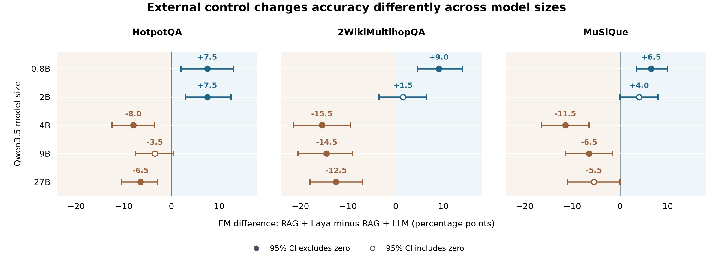
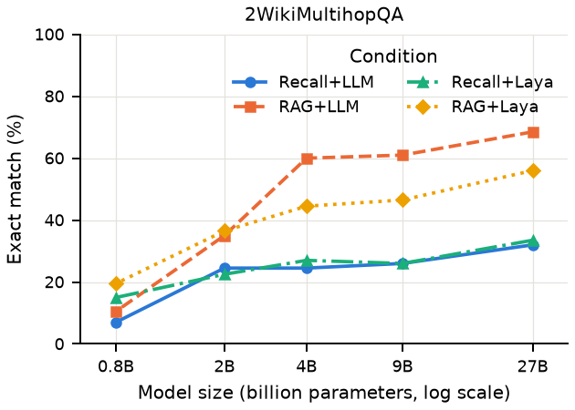
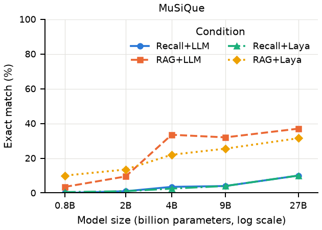
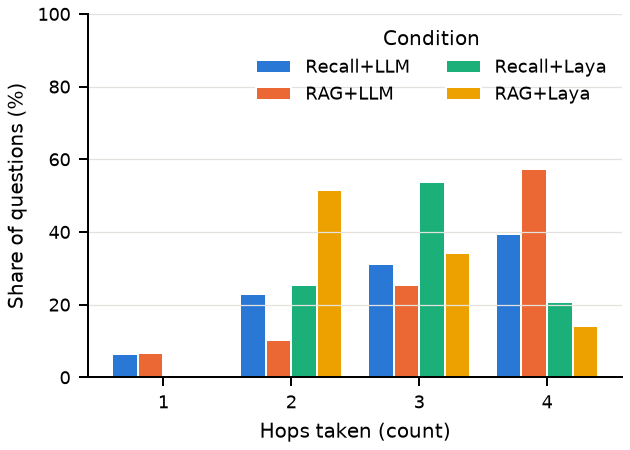

# Results / 實驗結果

Source run: `main-20260930`. Every row below comes from
[summary.csv](../data/runs/main-20260930/summary.csv), generated from the
[per-question records](../data/runs/main-20260930/records/).
All configurations contain 200 final records; failed answers remain in the denominator.
The [verification report](verification.json) records the publication reproduction check.

## Reading the findings / 結果導讀

The [paper's research narrative](../README.en.md) follows three questions: what changes
accuracy, what changes cost, and how those effects depend on model scale. Read the
results in that order:

1. **Evidence source:** compare Recall + LLM with RAG + LLM to assess the contribution
   of retrieval within the shared loop.
2. **Controller and scale:** compare RAG + LLM with RAG + Laya at each model size.
   The plot below shows the effect and its paired 95% interval; a hollow point includes zero.
3. **Cost and failure location:** read tokens, hops, and latency alongside the error
   taxonomy. Reduced computation can coincide with stopping before supporting evidence arrives.

中文閱讀順序：先看外部證據帶來多少改善，再看相同 RAG 下更換控制者的影響，最後用成本與錯誤分類解釋取捨。
0.8B 的正向效果在三個資料集的信賴區間均排除零；2B 僅 HotpotQA 排除零。4B–27B 的點估計皆為負，九個區間中七個排除零。

This additional overview is generated from the existing `bootstrap_ci.csv` and checked
against `summary.csv` by [plot_controller_effect.py](../scripts/plot_controller_effect.py).
Run `python scripts/plot_controller_effect.py` from the repository root; PNG and PDF
outputs are written to `results/figures/`. The five original paper figures remain below.

## Paper-to-data map

| Paper item | Artifact | Source / generator |
|---|---|---|
| Table 1: experimental design | `paper/sections/method.tex` | The four evidence/controller conditions |
| Table 2: probe + controller quality | [controller_probe.tex](../paper/tables/controller_probe.tex) | `probe_results.json`, historical `laya_eval_report.md`; `merge_tables.py` |
| Table 3: main results + paired effects | [main_results_panels.tex](../paper/tables/main_results_panels.tex) | `summary.csv`, `bootstrap_ci.csv`; `merge_tables.py` |
| Table 4: error taxonomy | [error_taxonomy.tex](../paper/tables/error_taxonomy.tex) | Records + supporting-paragraph annotations; `error_taxonomy.py` |
| Table 5: efficiency | [efficiency_panels.tex](../paper/tables/efficiency_panels.tex) | `summary.csv`; `merge_tables.py` |
| Table 6: errors by dataset | [error_taxonomy_by_dataset.tex](../paper/tables/error_taxonomy_by_dataset.tex) | `error_taxonomy.py` |
| Table 7: recall/retrieval effects | [effects_recall_retrieval.tex](../paper/tables/effects_recall_retrieval.tex) | `bootstrap_ci.csv`; `merge_tables.py` |
| Table 8: p95 latency | [efficiency_p95.tex](../paper/tables/efficiency_p95.tex) | `summary.csv`; `merge_tables.py` |
| Figures 1–3: EM by model size | `em_vs_size_*.pdf` in [paper/figures](../paper/figures/) | `results_aggregator.build_figures` |
| Figure 4: p50 latency | `latency_vs_size.pdf` | Same generator |
| Figure 5: hop distribution | `hops_distribution.pdf` | Same generator, from per-question traces |

Original full-precision answer-level measurements are in the JSONL records; CSV columns
are rounded as documented in [DATA.md](../docs/DATA.md). The 13 generated LaTeX files
also include legacy standalone tables; the paper uses the panels listed above.

## All 60 configurations

| Dataset | Qwen3.5 | Condition | EM % | F1 % | p50 ms | In tokens | Out tokens | Hops |
|---|---|---|---:|---:|---:|---:|---:|---:|
| hotpotqa | qwen3.5:27b | recall_llm | 30.0 | 39.9 | 7965 | 1995 | 499 | 2.63 |
| hotpotqa | qwen3.5:27b | rag_llm | 67.5 | 79.6 | 11918 | 3000 | 151 | 2.75 |
| hotpotqa | qwen3.5:27b | recall_laya | 28.0 | 38.9 | 17279 | 1586 | 482 | 2.98 |
| hotpotqa | qwen3.5:27b | rag_laya | 61.0 | 74.0 | 13482 | 1606 | 68 | 2.57 |
| hotpotqa | qwen3.5:9b | recall_llm | 21.0 | 30.4 | 2605 | 1856 | 309 | 2.56 |
| hotpotqa | qwen3.5:9b | rag_llm | 64.0 | 75.3 | 2022 | 2939 | 104 | 2.67 |
| hotpotqa | qwen3.5:9b | recall_laya | 21.0 | 30.0 | 2676 | 1509 | 344 | 3.02 |
| hotpotqa | qwen3.5:9b | rag_laya | 60.5 | 72.3 | 1570 | 1675 | 71 | 2.62 |
| hotpotqa | qwen3.5:4b | recall_llm | 21.0 | 29.7 | 1843 | 1934 | 476 | 2.55 |
| hotpotqa | qwen3.5:4b | rag_llm | 64.5 | 76.9 | 1961 | 3445 | 122 | 3.06 |
| hotpotqa | qwen3.5:4b | recall_laya | 21.5 | 31.1 | 2221 | 1569 | 509 | 2.92 |
| hotpotqa | qwen3.5:4b | rag_laya | 56.5 | 70.1 | 1095 | 1565 | 68 | 2.52 |
| hotpotqa | qwen3.5:2b | recall_llm | 16.5 | 23.3 | 2733 | 3196 | 526 | 3.79 |
| hotpotqa | qwen3.5:2b | rag_llm | 40.0 | 53.3 | 1880 | 4202 | 166 | 3.98 |
| hotpotqa | qwen3.5:2b | recall_laya | 16.5 | 22.1 | 1277 | 1287 | 315 | 2.67 |
| hotpotqa | qwen3.5:2b | rag_laya | 47.5 | 60.4 | 657 | 1578 | 73 | 2.51 |
| hotpotqa | qwen3.5:0.8b | recall_llm | 4.0 | 7.0 | 1565 | 2191 | 279 | 3.04 |
| hotpotqa | qwen3.5:0.8b | rag_llm | 23.0 | 29.1 | 1669 | 2961 | 143 | 3.17 |
| hotpotqa | qwen3.5:0.8b | recall_laya | 9.5 | 13.9 | 828 | 1345 | 192 | 2.75 |
| hotpotqa | qwen3.5:0.8b | rag_laya | 30.5 | 40.3 | 553 | 1875 | 81 | 2.65 |
| 2wiki | qwen3.5:27b | recall_llm | 32.0 | 38.5 | 7882 | 2101 | 290 | 3.00 |
| 2wiki | qwen3.5:27b | rag_llm | 68.5 | 76.0 | 11044 | 5490 | 136 | 3.19 |
| 2wiki | qwen3.5:27b | recall_laya | 33.5 | 39.4 | 13780 | 1544 | 317 | 3.15 |
| 2wiki | qwen3.5:27b | rag_laya | 56.0 | 60.9 | 11490 | 2293 | 64 | 2.54 |
| 2wiki | qwen3.5:9b | recall_llm | 26.0 | 30.0 | 2745 | 1907 | 228 | 2.82 |
| 2wiki | qwen3.5:9b | rag_llm | 61.0 | 69.0 | 3256 | 5385 | 121 | 3.21 |
| 2wiki | qwen3.5:9b | recall_laya | 26.0 | 29.5 | 2501 | 1440 | 212 | 3.07 |
| 2wiki | qwen3.5:9b | rag_laya | 46.5 | 52.2 | 1763 | 2329 | 64 | 2.55 |
| 2wiki | qwen3.5:4b | recall_llm | 24.5 | 28.5 | 1642 | 1700 | 254 | 2.42 |
| 2wiki | qwen3.5:4b | rag_llm | 60.0 | 68.8 | 2851 | 6001 | 130 | 3.42 |
| 2wiki | qwen3.5:4b | recall_laya | 27.0 | 31.2 | 2096 | 1491 | 306 | 2.99 |
| 2wiki | qwen3.5:4b | rag_laya | 44.5 | 50.3 | 1452 | 2280 | 73 | 2.53 |
| 2wiki | qwen3.5:2b | recall_llm | 24.5 | 28.3 | 2724 | 3183 | 501 | 3.88 |
| 2wiki | qwen3.5:2b | rag_llm | 35.0 | 39.6 | 2723 | 6067 | 157 | 4.00 |
| 2wiki | qwen3.5:2b | recall_laya | 22.5 | 27.0 | 1335 | 1325 | 234 | 2.75 |
| 2wiki | qwen3.5:2b | rag_laya | 36.5 | 41.8 | 859 | 1885 | 59 | 2.36 |
| 2wiki | qwen3.5:0.8b | recall_llm | 7.0 | 8.6 | 1443 | 2044 | 262 | 2.90 |
| 2wiki | qwen3.5:0.8b | rag_llm | 10.5 | 13.1 | 1947 | 3459 | 125 | 2.83 |
| 2wiki | qwen3.5:0.8b | recall_laya | 15.0 | 17.5 | 712 | 1124 | 167 | 2.62 |
| 2wiki | qwen3.5:0.8b | rag_laya | 19.5 | 23.2 | 753 | 1903 | 61 | 2.37 |
| musique | qwen3.5:27b | recall_llm | 10.0 | 17.0 | 9771 | 2500 | 595 | 3.19 |
| musique | qwen3.5:27b | rag_llm | 37.0 | 50.3 | 16217 | 4736 | 271 | 3.55 |
| musique | qwen3.5:27b | recall_laya | 10.0 | 18.2 | 18126 | 1667 | 439 | 3.18 |
| musique | qwen3.5:27b | rag_laya | 31.5 | 41.3 | 13170 | 2187 | 76 | 2.81 |
| musique | qwen3.5:9b | recall_llm | 4.0 | 10.5 | 3000 | 2096 | 353 | 2.95 |
| musique | qwen3.5:9b | rag_llm | 32.0 | 43.6 | 3028 | 4628 | 177 | 3.52 |
| musique | qwen3.5:9b | recall_laya | 4.0 | 11.4 | 2770 | 1579 | 243 | 3.20 |
| musique | qwen3.5:9b | rag_laya | 25.5 | 36.2 | 1731 | 2324 | 80 | 2.89 |
| musique | qwen3.5:4b | recall_llm | 3.5 | 8.8 | 2960 | 2461 | 414 | 3.08 |
| musique | qwen3.5:4b | rag_llm | 33.5 | 44.9 | 2791 | 5018 | 146 | 3.75 |
| musique | qwen3.5:4b | recall_laya | 2.5 | 8.5 | 2445 | 1734 | 321 | 3.15 |
| musique | qwen3.5:4b | rag_laya | 22.0 | 33.0 | 1408 | 2255 | 80 | 2.88 |
| musique | qwen3.5:2b | recall_llm | 1.0 | 7.0 | 2826 | 3363 | 491 | 3.98 |
| musique | qwen3.5:2b | rag_llm | 9.5 | 15.3 | 1818 | 4275 | 156 | 4.00 |
| musique | qwen3.5:2b | recall_laya | 1.0 | 6.2 | 1494 | 1699 | 290 | 3.10 |
| musique | qwen3.5:2b | rag_laya | 13.5 | 20.1 | 963 | 2325 | 93 | 2.94 |
| musique | qwen3.5:0.8b | recall_llm | 0.0 | 1.8 | 1464 | 1978 | 263 | 2.75 |
| musique | qwen3.5:0.8b | rag_llm | 3.5 | 6.7 | 1476 | 2776 | 139 | 2.89 |
| musique | qwen3.5:0.8b | recall_laya | 0.5 | 4.2 | 741 | 1328 | 193 | 2.73 |
| musique | qwen3.5:0.8b | rag_laya | 10.0 | 13.6 | 532 | 1954 | 86 | 2.69 |

## Figure previews

